House Prices Kaggle Comp
================
Nicholas Wolczynski
2/23/2019

Setup + Data Exploration + Data Preparation
===========================================

``` r
#load data
train <- read.csv("train.csv")
test <- read.csv("test.csv")
```

We are trying to build a model that best predicts housing sales price based on the predictors. First, lets look at the dimensions of our dataset.

``` r
print(paste("# of Observations: ", nrow(train)))
```

    ## [1] "# of Observations:  1460"

``` r
print(paste("# of Features: " , (ncol(train) - 1)))
```

    ## [1] "# of Features:  80"

Distribution of response:

``` r
ggplot(train, aes(x=SalePrice)) + geom_density(fill = "dark green") + 
  scale_x_continuous(breaks = pretty_breaks()) + 
  geom_vline(aes(xintercept=mean(SalePrice)),color="light blue", linetype="dashed", size=1) + 
  ggtitle("Sales Price Density Plot") + 
  theme(plot.title = element_text(color="black", size=14, hjust = 0.5))
```


It appears the response is somewhat right skewed. Taking the log of the response should remove the skew and prevent problems down the line:

``` r
ggplot(train, aes(x=log(SalePrice))) + geom_density(fill = "dark green") + 
  scale_x_continuous(breaks = pretty_breaks()) + 
  geom_vline(aes(xintercept=mean(log(SalePrice))),color="light blue", linetype="dashed", size=1) + 
  ggtitle("Log Sales Price Density Plot") + 
  theme(plot.title = element_text(color="black", size=14, hjust = 0.5))
```

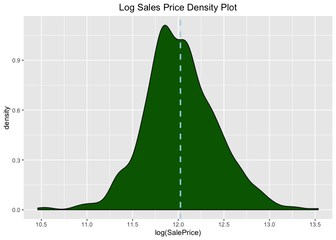

Now let's move onto our predictors. First, there are several predictors with NA values which will cause issues when building out a model.

``` r
colSums(is.na(train))[colSums(is.na(train)) > 0]
```

    ##  LotFrontage        Alley   MasVnrType   MasVnrArea     BsmtQual 
    ##          259         1369            8            8           37 
    ##     BsmtCond BsmtExposure BsmtFinType1 BsmtFinType2   Electrical 
    ##           37           38           37           38            1 
    ##  FireplaceQu   GarageType  GarageYrBlt GarageFinish   GarageQual 
    ##          690           81           81           81           81 
    ##   GarageCond       PoolQC        Fence  MiscFeature 
    ##           81         1453         1179         1406

A few variables seem to be NA for almost the entire dataset ("Alley", "PoolQC", "Fence", "MiscFeature"). First, let's take a quick look and see if these could still be useful.

``` r
plot1 <- ggplot(train, aes(x = Alley, y = SalePrice)) + 
  geom_boxplot(stat = "boxplot", position = "dodge", outlier.colour = "red", 
               outlier.shape = 16, outlier.size = 2, notch = F, notchwidth = 0.5)

plot2 <- ggplot(train, aes(x = PoolQC, y = SalePrice)) + 
  geom_boxplot(stat = "boxplot", position = "dodge", outlier.colour = "red", 
               outlier.shape = 16, outlier.size = 2, notch = F, notchwidth = 0.5)

plot3 <- ggplot(train, aes(x = Fence, y = SalePrice)) + 
  geom_boxplot(stat = "boxplot", position = "dodge", outlier.colour = "red", 
               outlier.shape = 16, outlier.size = 2, notch = F, notchwidth = 0.5)

plot4 <- ggplot(train, aes(x = MiscFeature, y = SalePrice)) + 
  geom_boxplot(stat = "boxplot", position = "dodge", outlier.colour = "red", 
               outlier.shape = 16, outlier.size = 2, notch = F, notchwidth = 0.5)

grid.arrange(plot1, plot2, plot3, plot4, ncol=2)
```

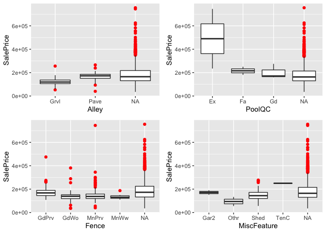

Although these features primarily take NA values, it seems that there could be a strong relationship with the response and the non-NA values of these features, so it can be worthwhile to leave these features in and let the model decide. In order to do so, we need to add another level to each factor feature, and then convert the NA values to that new value.

``` r
##function that will add "NA" factor to factor columns with NA values
addNA <- function(x){
  if(is.factor(x)) return(factor(x, levels=c(levels(x), "NA")))
  return(x)
}

train_backup <- train
train <- as.data.frame(lapply(train, addNA))
```

``` r
## replace factor feature NA values with "NA" string.
train[, lapply(train,is.factor) == TRUE][is.na(train[, lapply(train,is.factor) == TRUE])] <- "NA"

## replace remaining integer feature NA values with 0/
train[is.na(train)] <- 0


##lets do the same to the test data

test <- as.data.frame(lapply(test, addNA))

test[, lapply(test,is.factor) == TRUE][is.na(test[, lapply(test,is.factor) == TRUE])] <- "NA"

test[is.na(test)] <- 0
```

Our numeric predictors might also be heavily skewed or have high kurtosis. It is unreasonable to investigate density plots of each of our predictors, so lets just take a look at kurtosis and skewness measures to see whether there are any features that could benefit from scaling.

``` r
skew <- data.frame("Feature" = names(skewness(train[, sapply(train, is.numeric)])), "Skew" = skewness(train[, sapply(train, is.numeric)]))

kurt <- data.frame("Feature" = names(kurtosis(train[, sapply(train, is.numeric)])), "Kurtosis" = kurtosis(train[, sapply(train, is.numeric)]))


ggplot(skew, aes(x = Feature, y = Skew)) + geom_bar(stat = "identity") + theme(axis.text.x = element_text(angle = 90, hjust = 1)) + ggtitle("Skewness")
```

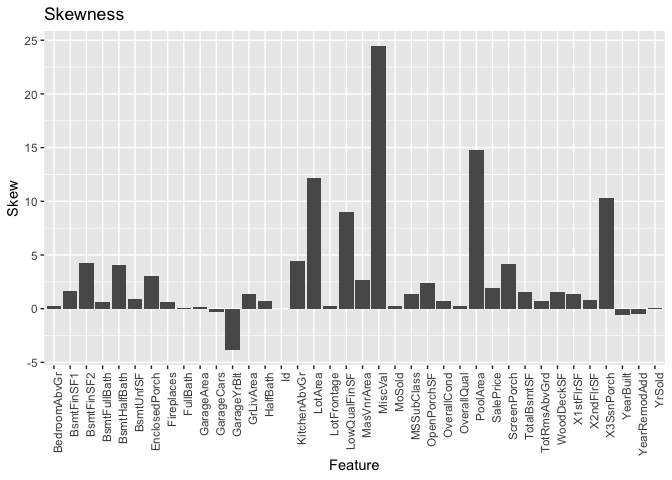

``` r
ggplot(kurt, aes(x = Feature, y = Kurtosis)) + geom_bar(stat = "identity") + theme(axis.text.x = element_text(angle = 90, hjust = 1)) + ggtitle("Kurtosis")
```

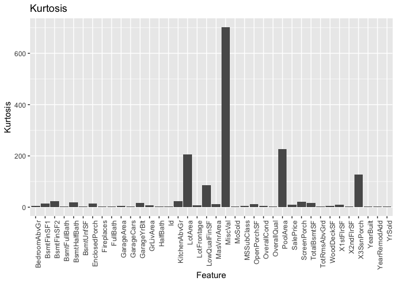

``` r
top_n(skew, 5)
```

    ## Selecting by Skew

    ##        Feature     Skew
    ## 1      LotArea 12.19514
    ## 2 LowQualFinSF  9.00208
    ## 3   X3SsnPorch 10.29375
    ## 4     PoolArea 14.81313
    ## 5      MiscVal 24.45164

``` r
top_n(kurt, 5)
```

    ## Selecting by Kurtosis

    ##        Feature  Kurtosis
    ## 1      LotArea 205.54379
    ## 2 LowQualFinSF  85.94593
    ## 3   X3SsnPorch 126.23518
    ## 4     PoolArea 225.50051
    ## 5      MiscVal 701.60084

It appears the same 5 features have much higher skew and kurtosis than all the rest. We should make sure to scale these features.

``` r
scales <- build_scales(dataSet = train, cols = top_n(skew, 5)$Feature)
```

    ## Selecting by Skew

    ## [1] "build_scales: I will compute scale on  5 numeric columns."
    ## [1] "build_scales: it took me: 0s to compute scale for 5 numeric columns."

``` r
scaleTrain <- fastScale(train, scales = scales, verbose = FALSE)
scaleTest <- fastScale(test, scales = scales, verbose = FALSE)
```

Let's now see if there are any high leverage outliers in our data. I will check for by looking at the cook's distance and residuals of a standard linear model:

``` r
lmod <- lm(log(SalePrice)~., data = scaleTrain[, -c("Id")])
plot(lmod, which = c(1,2,5))
```

    ## Warning: not plotting observations with leverage one:
    ##   121, 186, 251, 272, 333, 347, 376, 399, 584, 596, 667, 811, 945, 949, 1004, 1012, 1188, 1231, 1271, 1276, 1299, 1322, 1371, 1380, 1387

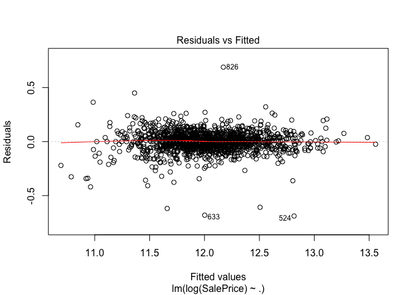

    ## Warning: not plotting observations with leverage one:
    ##   121, 186, 251, 272, 333, 347, 376, 399, 584, 596, 667, 811, 945, 949, 1004, 1012, 1188, 1231, 1271, 1276, 1299, 1322, 1371, 1380, 1387

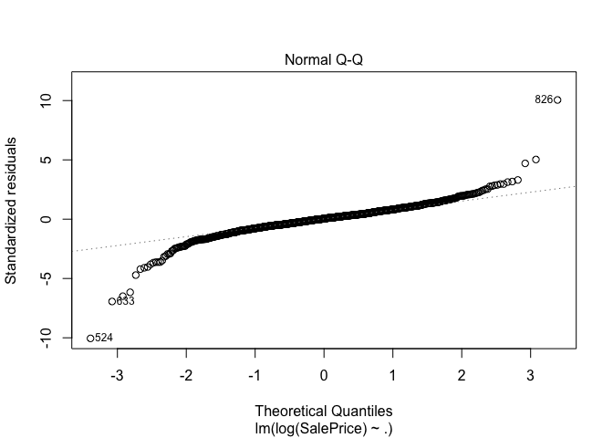

    ## Warning in sqrt(crit * p * (1 - hh)/hh): NaNs produced

    ## Warning in sqrt(crit * p * (1 - hh)/hh): NaNs produced

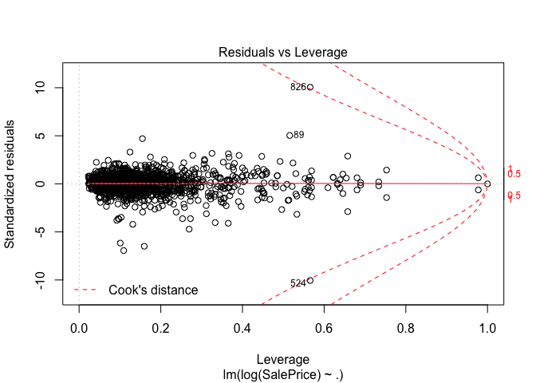

It appears that observations 826 and 524 have high residual values and high leverage:

``` r
scaleTrain[c(826,524), ]
```

    ##     Id MSSubClass MSZoning LotFrontage   LotArea Street Alley LotShape
    ## 1: 826         20       RL         114 0.4294217   Pave    NA      Reg
    ## 2: 524         60       RL         130 2.9632689   Pave    NA      IR1
    ##    LandContour Utilities LotConfig LandSlope Neighborhood Condition1
    ## 1:         Lvl    AllPub    Inside       Gtl      NridgHt       PosN
    ## 2:         Bnk    AllPub    Inside       Gtl      Edwards       PosN
    ##    Condition2 BldgType HouseStyle OverallQual OverallCond YearBuilt
    ## 1:       PosN     1Fam     1Story          10           5      2007
    ## 2:       PosN     1Fam     2Story          10           5      2007
    ##    YearRemodAdd RoofStyle RoofMatl Exterior1st Exterior2nd MasVnrType
    ## 1:         2008       Hip  CompShg     CemntBd     CmentBd    BrkFace
    ## 2:         2008       Hip  CompShg     CemntBd     CmentBd      Stone
    ##    MasVnrArea ExterQual ExterCond Foundation BsmtQual BsmtCond
    ## 1:        816        Ex        TA      PConc       Ex       TA
    ## 2:        762        Ex        TA      PConc       Ex       TA
    ##    BsmtExposure BsmtFinType1 BsmtFinSF1 BsmtFinType2 BsmtFinSF2 BsmtUnfSF
    ## 1:           Av          GLQ       1636          Unf          0       442
    ## 2:           Gd          GLQ       2260          Unf          0       878
    ##    TotalBsmtSF Heating HeatingQC CentralAir Electrical X1stFlrSF X2ndFlrSF
    ## 1:        2078    GasA        Ex          Y      SBrkr      2084         0
    ## 2:        3138    GasA        Ex          Y      SBrkr      3138      1538
    ##    LowQualFinSF GrLivArea BsmtFullBath BsmtHalfBath FullBath HalfBath
    ## 1:   -0.1202005      2084            1            0        2        0
    ## 2:   -0.1202005      4676            1            0        3        1
    ##    BedroomAbvGr KitchenAbvGr KitchenQual TotRmsAbvGrd Functional
    ## 1:            2            1          Ex            7        Typ
    ## 2:            3            1          Ex           11        Typ
    ##    Fireplaces FireplaceQu GarageType GarageYrBlt GarageFinish GarageCars
    ## 1:          1          Gd     Attchd        2007          Fin          3
    ## 2:          1          Gd    BuiltIn        2007          Fin          3
    ##    GarageArea GarageQual GarageCond PavedDrive WoodDeckSF OpenPorchSF
    ## 1:       1220         TA         TA          Y        188          45
    ## 2:        884         TA         TA          Y        208         406
    ##    EnclosedPorch X3SsnPorch ScreenPorch    PoolArea PoolQC Fence
    ## 1:             0 -0.1162994           0 -0.06866822     NA    NA
    ## 2:             0 -0.1162994           0 -0.06866822     NA    NA
    ##    MiscFeature     MiscVal MoSold YrSold SaleType SaleCondition SalePrice
    ## 1:          NA -0.08765778      6   2008      New       Partial    385000
    ## 2:          NA -0.08765778     10   2007      New       Partial    184750

It is tough to tell what is going on with these points, but we know they could have a big impact on our model (high leverage) while not following the general trend.

``` r
scaleTrainNoOutliers <- scaleTrain[-c(826,524), ]
```

Let's do the process one more time to make sure there aren't any new observations that could cause problems.

``` r
lmod2 <- lm(log(SalePrice)~., data = scaleTrainNoOutliers[, -c("Id")])
plot(lmod2, which = c(1,2,5))
```

    ## Warning: not plotting observations with leverage one:
    ##   121, 186, 251, 272, 326, 333, 347, 376, 399, 583, 595, 666, 810, 943, 947, 1002, 1010, 1186, 1229, 1269, 1274, 1297, 1320, 1369, 1378, 1385

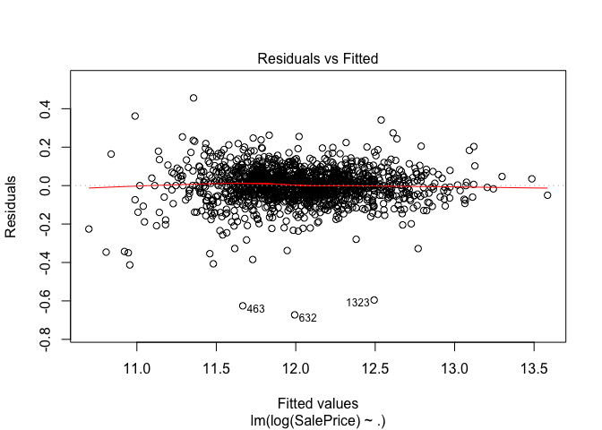

    ## Warning: not plotting observations with leverage one:
    ##   121, 186, 251, 272, 326, 333, 347, 376, 399, 583, 595, 666, 810, 943, 947, 1002, 1010, 1186, 1229, 1269, 1274, 1297, 1320, 1369, 1378, 1385

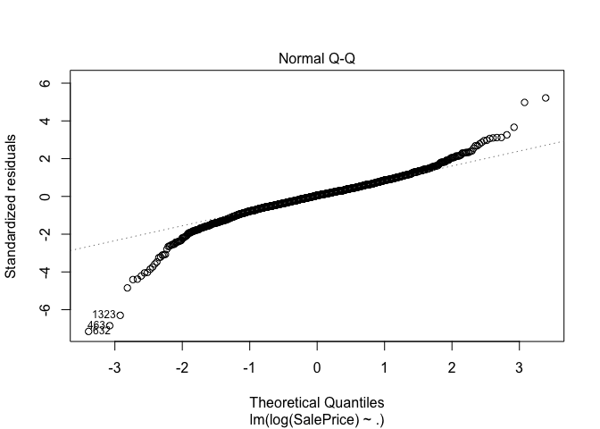

    ## Warning in sqrt(crit * p * (1 - hh)/hh): NaNs produced

    ## Warning in sqrt(crit * p * (1 - hh)/hh): NaNs produced

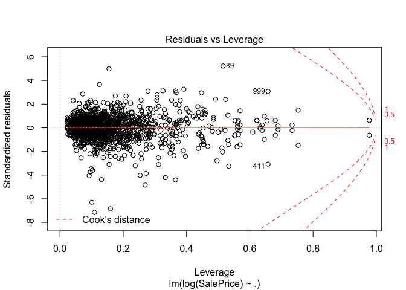

Although there are some outliers, they are not high leverage, so it should be alright to proceed with the current dataset.

``` r
encoding <- build_encoding(scaleTrainNoOutliers[ , -c("SalePrice", "Id")])
```

    ## [1] "build_encoding: I will compute encoding on 43 character and factor columns."
    ## [1] "build_encoding: it took me: 0.02s to compute encoding for 43 character and factor columns."

``` r
train.x <- one_hot_encoder(data = scaleTrainNoOutliers[ , -c("SalePrice", "Id")], encoding = encoding, drop = TRUE, verbose = FALSE)
test.x <- one_hot_encoder(data = scaleTest[, -c("Id")], encoding = encoding, drop = TRUE, verbose = FALSE)
train.y <- log(scaleTrainNoOutliers$SalePrice)
```

Now that we've encoded, our matrix is likely very sparse, let's drop columns with only constant values, bijections, or doubles.

``` r
doubles <- whichAreInDouble(train.x, verbose = FALSE)
train.x <- train.x[, -..doubles]
test.x <- test.x[, -..doubles]
bijections <- whichAreBijection(train.x, verbose = FALSE)
train.x <- train.x[, -..bijections]
test.x <- test.x[, -..bijections]
constant <- whichAreConstant(train.x, verbose = FALSE)
train.x <- train.x[, -..constant]
test.x <- test.x[, -..constant]
```

A final check that our train and test datasets are of same structure.

``` r
dim(train.x)
```

    ## [1] 1458  294

``` r
dim(test.x)
```

    ## [1] 1459  294

``` r
test.x <- sameShape(test.x, referenceSet = train.x, verbose = TRUE)
```

    ## [1] "sameShape: verify that every column is present."
    ## [1] "sameShape: drop unwanted columns."
    ## [1] "sameShape: verify that every column is in the right type."
    ## [1] "sameShape: BsmtFinSF1 class was numeric i set it to integer."
    ## [1] "sameShape: BsmtFinSF2 class was numeric i set it to integer."
    ## [1] "sameShape: BsmtUnfSF class was numeric i set it to integer."
    ## [1] "sameShape: TotalBsmtSF class was numeric i set it to integer."
    ## [1] "sameShape: BsmtFullBath class was numeric i set it to integer."
    ## [1] "sameShape: BsmtHalfBath class was numeric i set it to integer."
    ## [1] "sameShape: GarageCars class was numeric i set it to integer."
    ## [1] "sameShape: GarageArea class was numeric i set it to integer."
    ## [1] "sameShape: verify that every factor as the right number of levels."

Model Selection
===============

I want to use a method that will reduce the dimensionality of our data while making accurate predictions. Good options are lasso and principle components regression. I will also try a ridge regression approach which does not eliminate features.

### Lasso Regression:

``` r
test.x.matrix <- model.matrix(~., test.x)
train.x.matrix <- model.matrix(~., train.x)
```

``` r
mod.lasso = cv.glmnet(train.x.matrix, train.y, alpha = 1, nfolds = 5)
bestlam.lasso = mod.lasso$lambda.min
```

``` r
plot(mod.lasso)
```

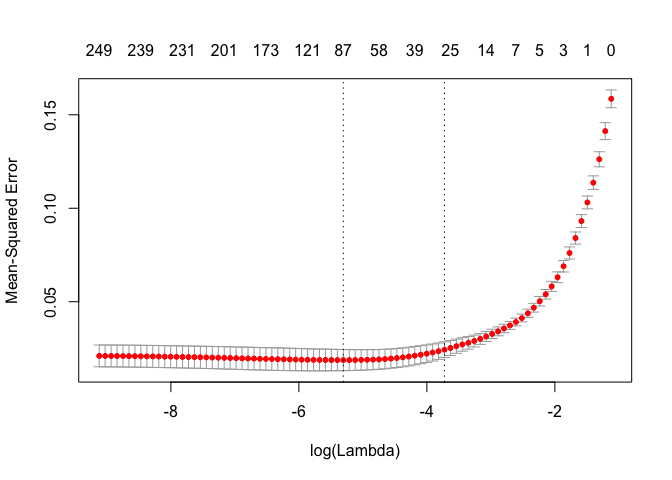

``` r
bestlam.lasso
```

    ## [1] 0.004962597

``` r
min(sqrt(mod.lasso$cvm))
```

    ## [1] 0.1370349

With lambda = 0.004, our model produces a root mean cross-validated error of 0.135.

``` r
finalmod.lasso <- glmnet(train.x.matrix, train.y, alpha = 1, lambda = bestlam.lasso)
```

Now let's make predictions and submit to the kaggle comp!

``` r
pred.lasso <- exp(predict(finalmod.lasso, newx = test.x.matrix))
```

``` r
predictions.lasso <- data.frame("Id" = test$Id, 
                          "SalePrice" = pred.lasso)

names(predictions.lasso)[2] <- "SalePrice"

write.csv(x = predictions.lasso, "lassoPredicts.csv")
```

**Kaggle Score: ** 0.1233

### Ridge Regression:

``` r
mod.ridge = cv.glmnet(train.x.matrix, train.y, alpha = 0, nfolds = 5)
bestlam.ridge = mod.ridge$lambda.min
```

``` r
plot(mod.ridge)
```

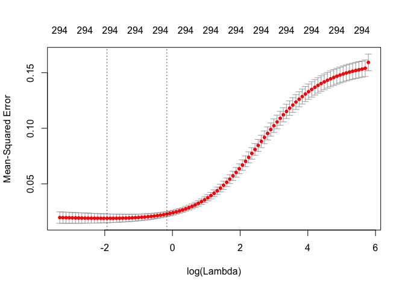

``` r
bestlam.ridge
```

    ## [1] 0.1446623

``` r
min(sqrt(mod.ridge$cvm))
```

    ## [1] 0.1378042

With lambda = 0.12, our model produces a root mean cross-validated error of 0.134.

``` r
finalmod.ridge <- glmnet(train.x.matrix, train.y, alpha = 0, lambda = bestlam.ridge)
```

Now let's make predictions and submit to the kaggle comp!

``` r
pred.ridge <- exp(predict(finalmod.ridge, newx = test.x.matrix))
```

``` r
predictions.ridge <- data.frame("Id" = test$Id, 
                          "SalePrice" = pred.ridge)

names(predictions.ridge)[2] <- "SalePrice"

write.csv(x = predictions.ridge, "ridgePredicts.csv")
```

**Kaggle Score: ** Not yet submitted.

### Principle Components Regression

``` r
train.x$SalePrice <- train.y
```

``` r
mod.pcr <- pcr(SalePrice~., data = train.x, validation = "CV", segments = 5, ncomp = 225)
validationplot(mod.pcr, val.type="RMSEP", main = "Validation Plot")
```

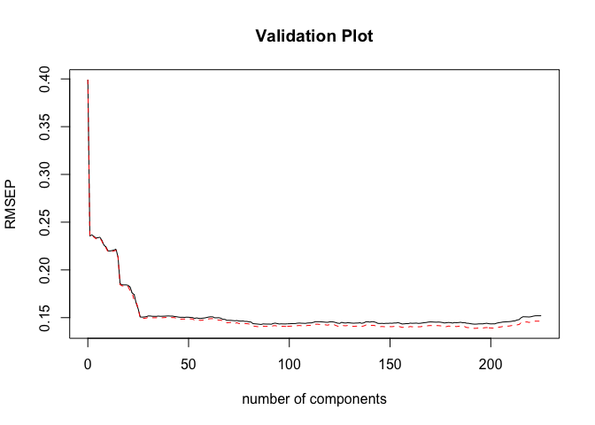

It does not appear that there is not much advantage to suing more than ~ 25 principle components. Let's take a closer look at the validation plot:

``` r
validationplot(mod.pcr, val.type="RMSEP", ncomp = 20:40, main = "Validation Plot")
```

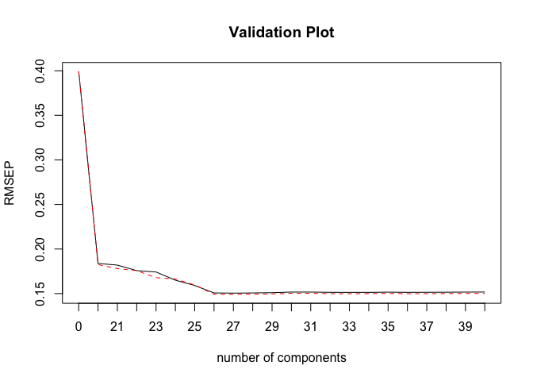

It appears that 26 principle components is our ideal choice, and it performs just about as well as our lasso model (although taking more principle components could improve the model). Let's make predictions on the test data using both methods.

``` r
preds.pcr26 <- exp(predict(mod.pcr, newdata = test.x, ncomp = 26))

predictions.pcr26 <- data.frame("Id" = test$Id, 
                          "SalePrice" = preds.pcr26)

names(predictions.pcr26)[2] <- "SalePrice"

write.csv(x = predictions.pcr26, "pcr26Predicts.csv")
```

**Kaggle Score: ** .13696

Lets try it with a higher amount of PCs:

``` r
preds.pcr85 <- exp(predict(mod.pcr, newdata = test.x, ncomp = 85))

predictions.pcr85 <- data.frame("Id" = test$Id, 
                          "SalePrice" = preds.pcr85)

names(predictions.pcr85)[2] <- "SalePrice"

write.csv(x = predictions.pcr85, "pcr85Predicts.csv")
```

**Kaggle Score: ** Not yet submitted

Final Comments
==============

Lasso regression is an excellent choice when making predictions thanks to its excellent performance and dimensionality reduction. Additionally, although not written about above, my initial predictions were based off data that was not scaled and outliers were not removed. Performing these steps as seen above led to significant improvement in test performance.
