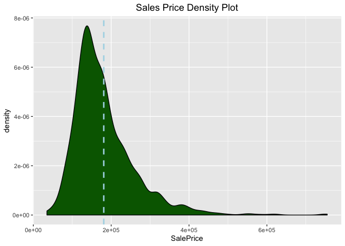
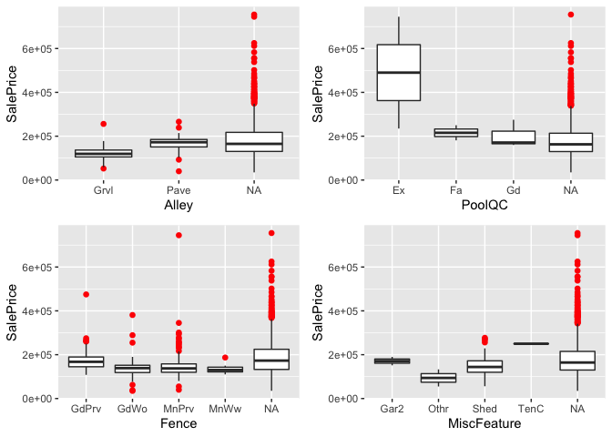
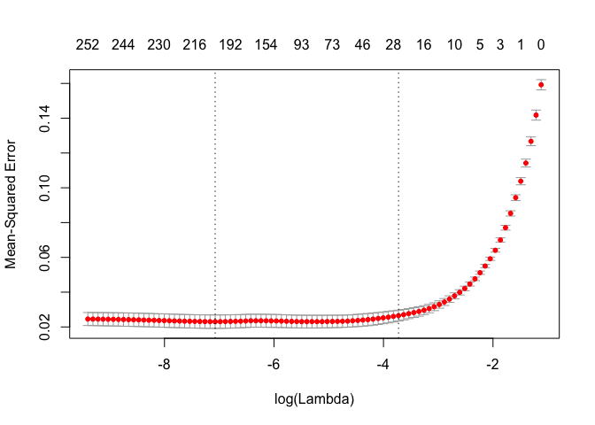

House Prices Kaggle Comp
================
Nicholas Wolczynski
2/23/2019

Setup + Data Exploration + Data Cleaning
========================================

We are trying to build a model that best predicts housing sales price based on the predictors. First, lets look at the dimensions of our dataset.

``` r
print(paste("# of Observations: ", nrow(train)))
```

    ## [1] "# of Observations:  1460"

``` r
print(paste("# of Features: " , (ncol(train) - 1)))
```

    ## [1] "# of Features:  80"

Distribution of response:

``` r
ggplot(train, aes(x=SalePrice)) + geom_density(fill = "dark green") + 
  scale_x_continuous(breaks = pretty_breaks()) + 
  geom_vline(aes(xintercept=mean(SalePrice)),color="light blue", linetype="dashed", size=1) + 
  ggtitle("Sales Price Density Plot") + 
  theme(plot.title = element_text(color="black", size=14, hjust = 0.5))
```



It appears the response is somewhat right skewed. Taking the log of the response should remove the skew and prevent problems down the line:

``` r
ggplot(train, aes(x=log(SalePrice))) + geom_density(fill = "dark green") + 
  scale_x_continuous(breaks = pretty_breaks()) + 
  geom_vline(aes(xintercept=mean(log(SalePrice))),color="light blue", linetype="dashed", size=1) + 
  ggtitle("Log Sales Price Density Plot") + 
  theme(plot.title = element_text(color="black", size=14, hjust = 0.5))
```


Now let's move onto our predictors. First, there are several predictors with NA values which will cause issues when building out a model.

``` r
colSums(is.na(train))[colSums(is.na(train)) > 0]
```

    ##  LotFrontage        Alley   MasVnrType   MasVnrArea     BsmtQual 
    ##          259         1369            8            8           37 
    ##     BsmtCond BsmtExposure BsmtFinType1 BsmtFinType2   Electrical 
    ##           37           38           37           38            1 
    ##  FireplaceQu   GarageType  GarageYrBlt GarageFinish   GarageQual 
    ##          690           81           81           81           81 
    ##   GarageCond       PoolQC        Fence  MiscFeature 
    ##           81         1453         1179         1406

A few variables seem to be NA for almost the entire dataset ("Alley", "PoolQC", "Fence", "MiscFeature"). First, let's take a quick look and see if there is a relationship

``` r
plot1 <- ggplot(train, aes(x = Alley, y = SalePrice)) + 
  geom_boxplot(stat = "boxplot", position = "dodge", outlier.colour = "red", 
               outlier.shape = 16, outlier.size = 2, notch = F, notchwidth = 0.5)

plot2 <- ggplot(train, aes(x = PoolQC, y = SalePrice)) + 
  geom_boxplot(stat = "boxplot", position = "dodge", outlier.colour = "red", 
               outlier.shape = 16, outlier.size = 2, notch = F, notchwidth = 0.5)

plot3 <- ggplot(train, aes(x = Fence, y = SalePrice)) + 
  geom_boxplot(stat = "boxplot", position = "dodge", outlier.colour = "red", 
               outlier.shape = 16, outlier.size = 2, notch = F, notchwidth = 0.5)

plot4 <- ggplot(train, aes(x = MiscFeature, y = SalePrice)) + 
  geom_boxplot(stat = "boxplot", position = "dodge", outlier.colour = "red", 
               outlier.shape = 16, outlier.size = 2, notch = F, notchwidth = 0.5)

grid.arrange(plot1, plot2, plot3, plot4, ncol=2)
```



Although these features primarily take NA values, it seems that there could be a strong relationship with the response and the non-NA values of these features, so it can be worthwhile to leave these features in. In order to do so, we need to add another level to each factor feature, and then convert the NA values to that new value.

``` r
##function that will add "NA" factor to factor columns with NA values
addNA <- function(x){
  if(is.factor(x) & sum(is.na(x)) > 0) return(factor(x, levels=c(levels(x), "NA")))
  return(x)
}

train_backup <- train
train <- as.data.frame(lapply(train, addNA))
```

``` r
## replace factor feature NA values with "NA" string.
train[, lapply(train,is.factor) == TRUE][is.na(train[, lapply(train,is.factor) == TRUE])] <- "NA"

## replace remaining integer feature NA values with 0/
train[is.na(train)] <- 0
```

Model Selection
===============

Lasso Regression:

``` r
x <- model.matrix(SalePrice~., train)
y <- log(train$SalePrice)
```

``` r
mod.lasso = cv.glmnet(x, y, alpha = 1, nfolds = 5)
bestlam = mod.lasso$lambda.min
bestlam
```

    ## [1] 0.0008467928

``` r
plot(mod.lasso)
```


